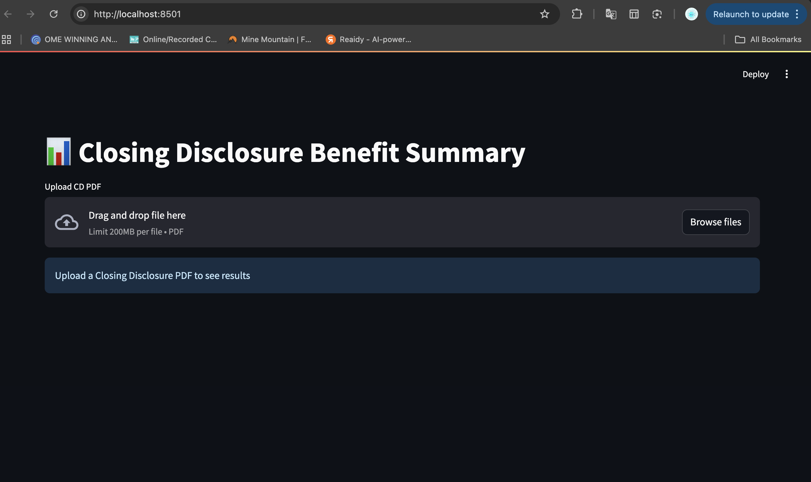
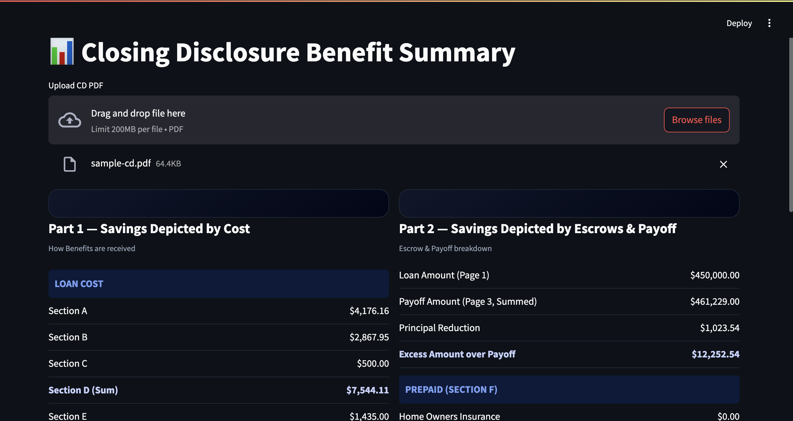
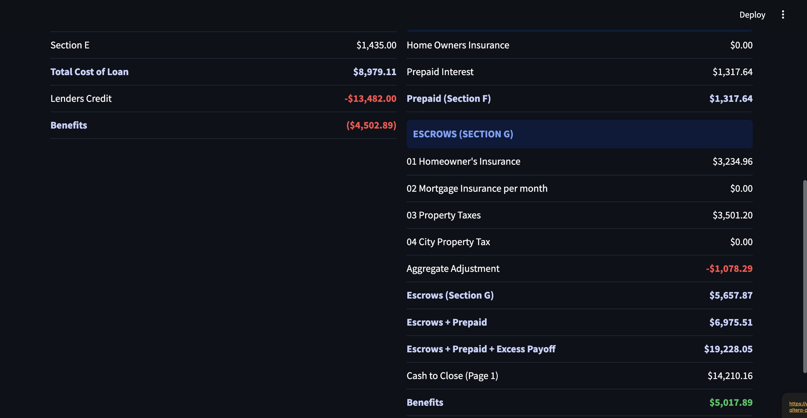
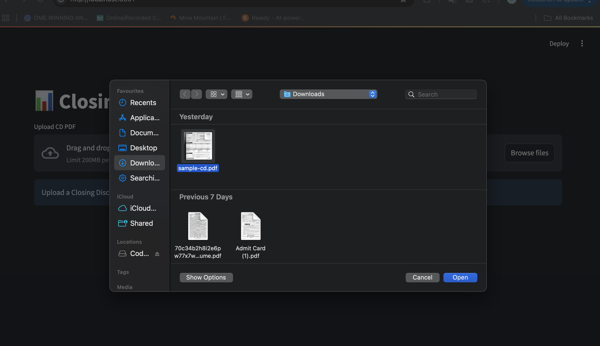

# 📊 Closing Disclosure Benefit Calculator

## 🚀 Overview

This project extracts financial data from a **Closing Disclosure (CD)** PDF and computes borrower benefits using two approaches:

* **Part 1 — Savings Depicted by Cost**
* **Part 2 — Savings Depicted by Escrows & Payoff**

A clean **Streamlit dashboard** is provided to visualize results in a structured financial format.

---

## 🧠 Approach

The solution is designed using a modular pipeline:

### 🔹 1. Parser (`parser.py`)

* Extracts raw text from PDF using `pdfplumber`
* Handles multi-page documents seamlessly

### 🔹 2. Extractor (`extractor.py`)

* Uses regex to extract financial values
* Handles:

  * multi-line values
  * multiple values in a single line
  * negative values (e.g., lender credits, adjustments)
  * missing values safely (`0.0` fallback)

### 🔹 3. Calculator (`calculator.py`)

Implements business logic:

#### ✅ Part 1:

* D = A + B + C
* Total Cost = D + E
* Benefit = Total Cost + Lender Credits

#### ✅ Part 2:

* Excess = Payoff + Principal − Loan Amount
* Benefit = (Escrow + Prepaid + Excess) − Cash to Close

### 🔹 4. UI (`app.py`)

* Built using Streamlit
* Dashboard-style layout
* Highlights key financial insights
* Matches expected output format

---

## 📂 Project Structure

```
cd-benefit-calculator/
│
├── app.py              # Streamlit UI
├── parser.py           # PDF text extraction
├── extractor.py        # Value extraction logic
├── calculator.py       # Benefit calculations
├── main.py             # CLI runner
├── requirements.txt
├── README.md
├── data/sample-cd.pdf
└── assets/
    ├── demo_1.png
    ├── demo_2.png
    ├── upload_page.png
    ├── select_img.png
    └── demo_screenrecording.mp4
 └── outputs/
    ├── output.json
    └── output.txt
```

---

## 🧪 Setup (Virtual Environment)

## Step 1: Create Virtual Environment
python -m venv test_env

## Step 2: Activate Virtual Environment 

### Mac / Linux
source test_env/bin/activate

### Windows(Command Prompt)
test_env\Scripts\activate

### Windows (PowerShell):
test_env\Scripts\Activate.ps1

---

## ⚙️ Run Instructions

```bash
# 1. Clone repo
git clone https://github.com/adityayadav4507/cd-benefit-calculator.git

# 2. Go inside folder
cd cd-benefit-calculator

# 3. Install dependencies
pip install -r requirements.txt

# 4. Run app
streamlit run app.py
```

---

## ⚠️ Assumptions

* Missing or blank values → treated as `0.0`
* Currency format → `$X,XXX.XX`
* Negative values handled using regex (`-`)
* Some values may appear on adjacent lines (handled explicitly)
* Designed for standard Closing Disclosure format

---

## 📊 Output

✔ Loan Cost Summary
✔ Escrow & Payoff Summary
✔ Final Benefit Calculation

---

## 📸 Demo

### 🔹 Upload Interface
<p align="center">
  
</p>


---

### 🔹 Part 1 — Loan Cost Summary



---

### 🔹 Part 2 — Escrow & Payoff Summary



---

### 🔹 File Selection



---

### 🎥 Demo Recording

👉 [Watch Demo Video](assets/demo_screenrecording.mp4)

---

## 💡 Highlights

* 🔥 Robust PDF parsing (real-world messy data)
* 🔥 Handles multi-line + multi-value extraction
* 🔥 Clean modular architecture
* 🔥 Accurate financial computations
* 🔥 Professional dashboard UI

---

## 👨‍💻 Author

**Aditya Yadav**
IIT (BHU), Varanasi

